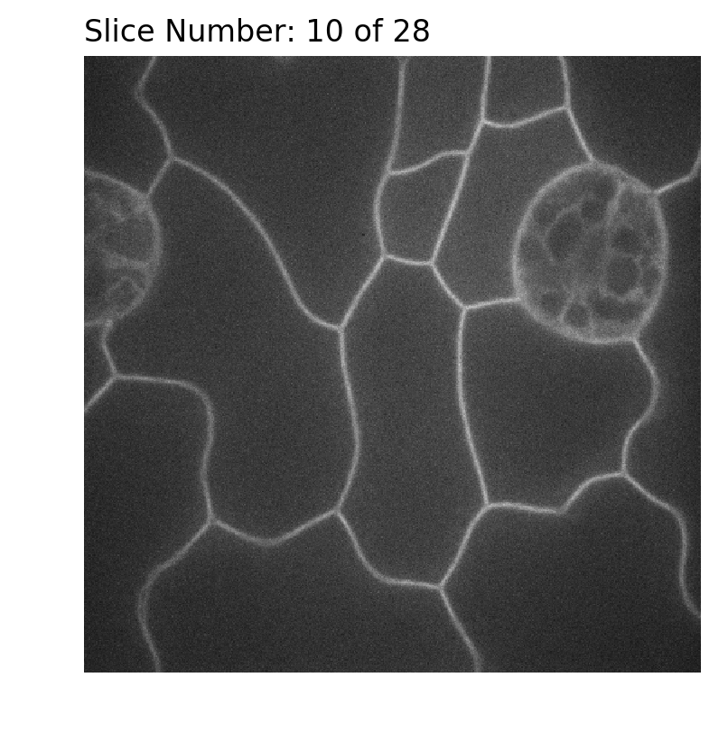
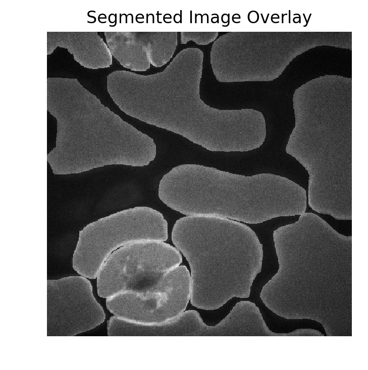

# **The Segmentation Mask Merger 5000**
#### Amil Khan | BisQue UCSB | Version 2.0
***


## Plot a Test Image

This helper function takes in one argument, `img_path`, which is simply the path of the image on your local computer. This step can be stepped if:
- You know what your data looks like
- Trust that everything in this notebook works
- Verified the absolute path of your image

**Arguments:**
- `img_path `: local path to volumetric image data, i.e. `.tif`


```python
def image_visualizer5000(img_path, num_slice=0):
    img = skimage.io.imread(img_path, plugin='pil')
    print("Successfully Loaded. Image Shape:", img.shape)
    filename, file_extension = os.path.splitext(img_path)
    io.imshow(img[num_slice])
    plt.title("Slice Number: {} of {}".format(num_slice, len(img)), loc='left')
    plt.axis('off')
```


```python
image_visualizer5000('/Users/macbook/Downloads/bisque-20190216.005014/T01.tif', num_slice=10)
```

    Successfully Loaded. Image Shape: (28, 512, 512)





## Segmentation Function

This function overlays a masked image over the original image
 takes two arguments, `NIFTI_img` and `volumetric_img`.

**Arguments:**
- `NIFTI_img `: local path to NIFTI image, i.e. `.nii`
- `volumetric_img `: local path to volumetric image data, i.e. `.tif`

**Output:**
- Overlaid image. Basically, NIFTI image + Volumetric with slight darkening to non-segmented region


```python
def segmentation(NIFTI_img, volumetric_img):

    filename, file_extension = os.path.splitext(NIFTI_img)
    if file_extension != '.nii':
        print("Invalid Filetype  --> ",filename+file_extension,"\nPlease check the filepath and/or if you are importing a valid NIFTI image.")
        return None

    nii_img = nib.load(NIFTI_img)
    nii_img = nii_img.get_fdata()
    print("Successfully Loaded NIFTI Image", nii_img.shape)

    mask = skimage.io.imread(volumetric_img, plugin='pil')
    mask = np.swapaxes(mask, axis1=0, axis2=2)

    print("Successfully Loaded Mask", mask.shape)
    overlay = np.zeros_like(nii_img)

    for i in range(nii_img.shape[-1]):
        overlay[:,:,i] = np.where((nii_img[:,:,i] >= 2) , mask[:,:,i], nii_img[:,:,i]*mask[:,:,i]+mask[:,:,i]/3)
        print('-', end=' ')
    print("\nSegmentation Merge Finished!\nOutput Shape:", np.rollaxis(overlay, axis=2).shape)
    return np.rollaxis(overlay, axis=2) # So BisQue can read and view image correctly
```


```python
tom = segmentation('/Users/macbook/Downloads/bisque-20190216.005040/all.nii', '/Users/macbook/Downloads/bisque-20190216.005014/T01.tif')
```

    Successfully Loaded NIFTI Image (512, 512, 28)
    Successfully Loaded Mask (512, 512, 28)
    - - - - - - - - - - - - - - - - - - - - - - - - - - - -
    Segmentation Merge Finished!
    Output Shape: (28, 512, 512)


## Verify the Output Image


```python
plt.imshow(tom[16], cmap='gray')
plt.title('Segmented Image Overlay')
plt.axis('off')
```


    (-0.5, 511.5, 511.5, -0.5)





## Output to HDF file

If you are feeling ambitious, you can output the image to an HDF file and visualize it in 2D slices and a 3D volume using [BisQue](https://bisque.ece.ucsb.edu/client_service/). The output file will be created in your current working directory.

**Arguments:**
- `filename `: name of the output hdf file
- `key_name `: key/name of dataset in the HDF file
- `img`: Output image from segmentation function


```python
def img_to_HDF(filename, key_name, img):
    f = h5py.File(filename, 'w')
    f.create_dataset(key_name, data=img)
    f.close()
```


```python
img_to_HDF(filename='SuperTom.h5', key_name='Finished_Product', img=tom)
```


***
